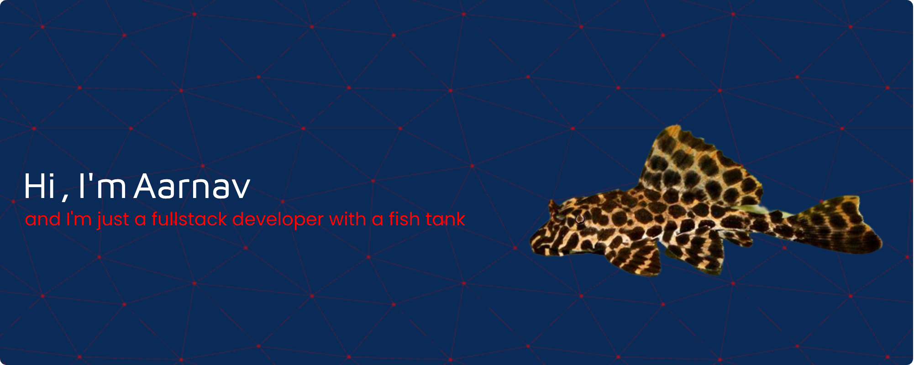

  

  
  
  

 

 

  
  
  

 
 
<h2 align="center">Some of my GitHub stats</h1>

  

  

  
  
  
  
  
  
  
  
  
  

 
 

  

<!-- <h2 align="center">What I'm listening to right now</h2> -->
<!-- 

  

 -->

<!--
**AarnavSrivastava/AarnavSrivastava** is a ✨ _special_ ✨ repository because its `README.md` (this file) appears on your GitHub profile.

Here are some ideas to get you started:

- 🔭 I’m currently working on ...
- 🌱 I’m currently learning ...
- 👯 I’m looking to collaborate on ...
- 🤔 I’m looking for help with ...
- 💬 Ask me about ...
- 📫 How to reach me: ...
- 😄 Pronouns: ...
- ⚡ Fun fact: ...
-->
